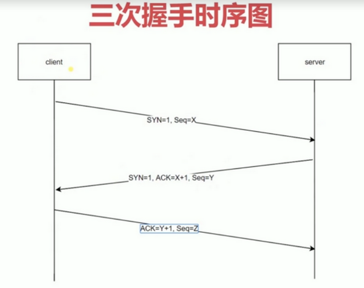

在讲三次握手之前，我们要了解一个概念：在我们的客户端和服务器之间进行 HTTP 请求的发送和返回的过程当中，我们是需要创建一个叫 **TCP connection** 的东西，因为 HTTP 是不存在 *连接* 这个概念的，它只有请求和响应这两个概念，请求和响应都是数据包，它们之间经过一个传输的通道，这个通道就是在 **TCP connection** 里面创建的，这个连接是可以一直保持在那边的，然后我们的 HTTP request 就是在这个基础之上去发送的，另一个 **TCP connection** 上是可以发送多个 HTPP 请求的（传输层比应用层低级），而通过 *HTTP/1.1* 声明一些参数是可以持久保持这个通道的，不是请求完一次就关闭。

## 三次握手时序图
  

  为什么我们要进行这么一个三次握手呢？这是为了防止服务端这边开启一些无用的连接，也防止数据传输丢失。

  要想查看这个过程，可以下载一些抓包工具进行嗅探学习（推荐 wireshake）
